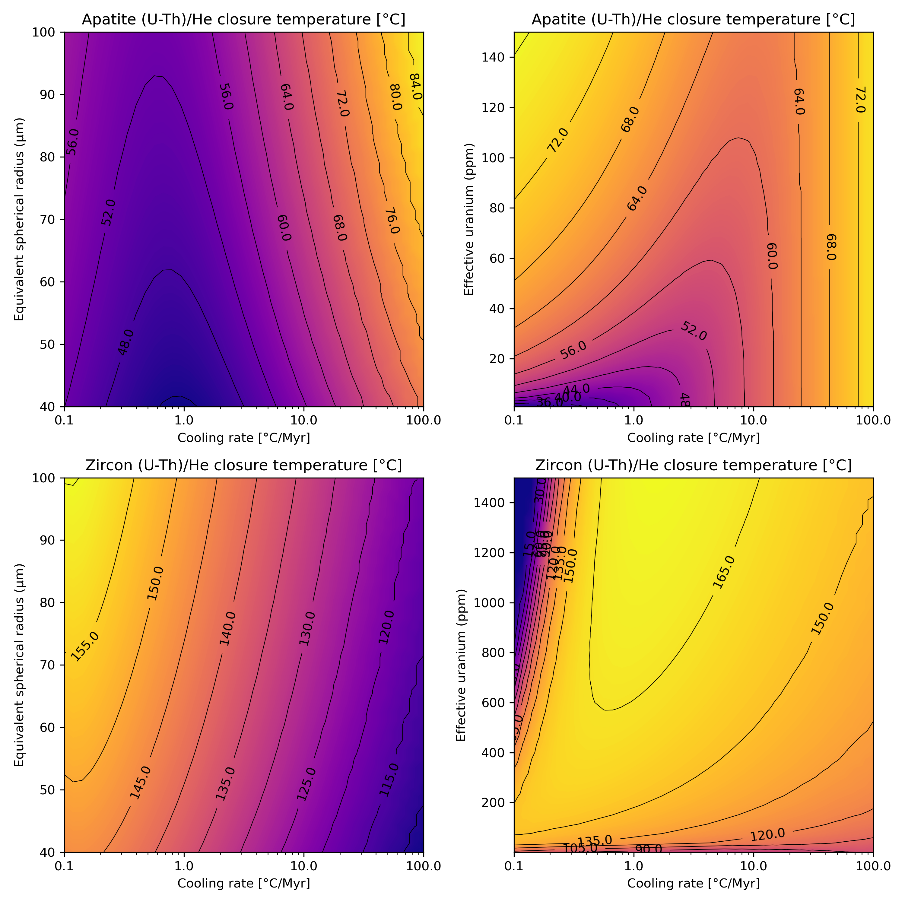

.. tcplotter documentation master file, created by
   sphinx-quickstart on Tue Jan 25 13:19:51 2022.
   You can adapt this file completely to your liking, but it should at least
   contain the root `toctree` directive.

T\ :sub:`c`\ plotter
=====================================

T\ :sub:`c`\ plotter is a Python package for creating and customizing thermochronometer age and closure temperature plots from the article "Modelling competing effects of cooling rate, grain size and radiation damage in low temperature thermochronometers" by D. Whipp, D. Kellett, I. Coutand, and R. Ketcham.

   An example plot created using T\ :sub:`c`\ plotter.

.. toctree::
   :maxdepth: 2
   :caption: Contents:

Indices and tables
==================

* :ref:`genindex`
* :ref:`modindex`
* :ref:`search`
